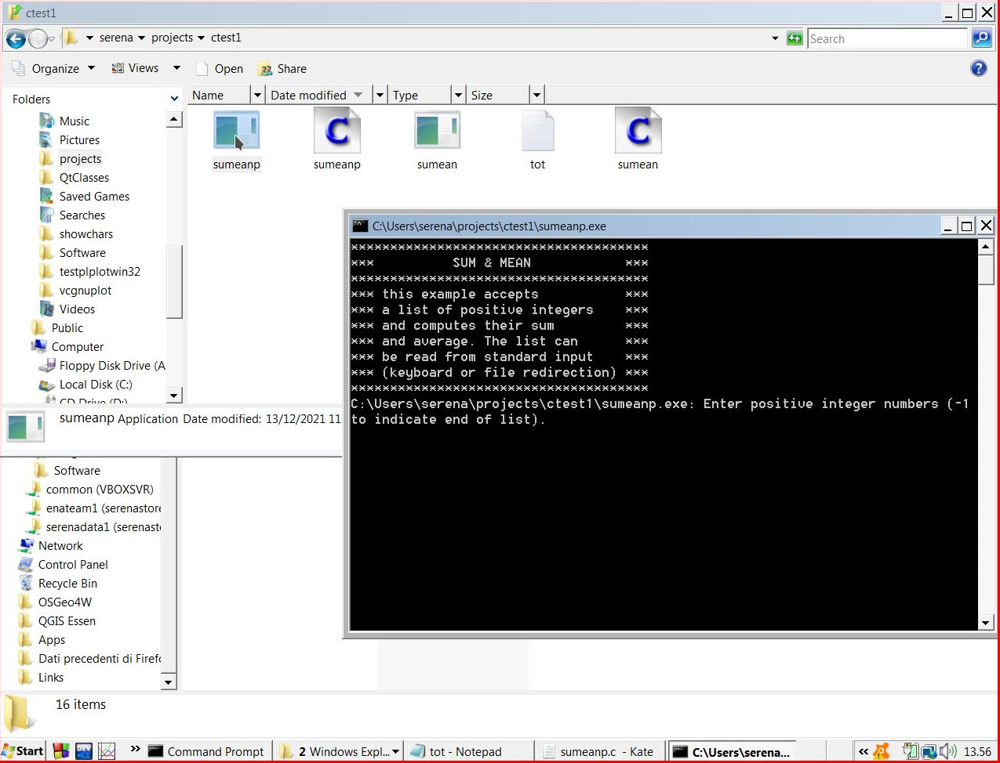
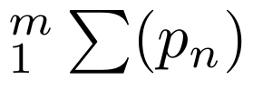
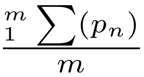
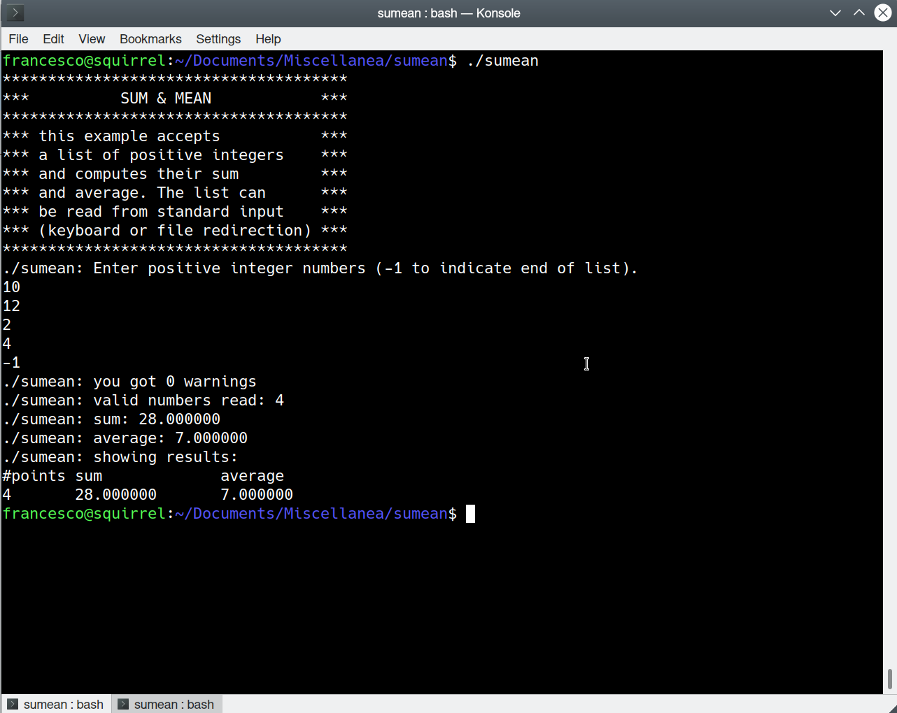
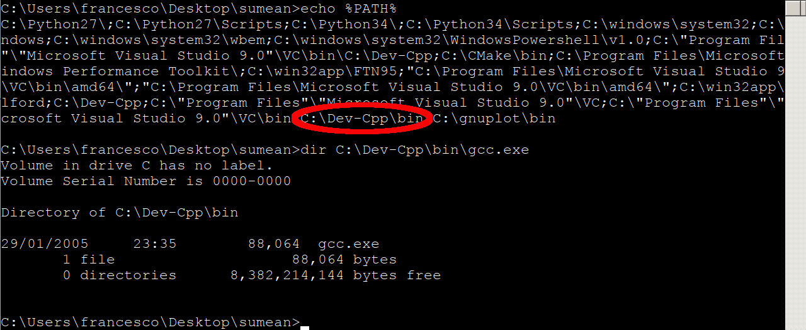

---
---

SUM & MEAN
==========

**simple terminal app example in c language**

Introduction
------------

This programming example accepts in input a list of positive integers
and computes their sum and average, showing them as output. At the end
of the execution it shows the number $m$ of input 1-D points, their sum

 

and their average value 

. 

The list can be read from standard input (keyboard or [file
redirection](https://en.wikipedia.org/wiki/Standard_streams)).

The [log](https://en.wikipedia.org/wiki/Logging_(software)) of what’s
going on with the computation is printed on the standard error output
stream, while the actual numerical output is printed on the standard
output at the end. This allows to use the app output as input of a
following app, that read from the standard input. The output created on
the standard input and/or the output created on the standard error can
be also saved in different text files.

How To
------

The following instructions are given supposing you’re yousing the GNU
[gcc](https://gcc.gnu.org/) c language compiler. You need to use a
terminal emulator, like xterm on MacOS or gnome-terminal or konsole on
GNU-Linux or
[cmd](https://www.howtogeek.com/235101/10-ways-to-open-the-command-prompt-in-windows-10/)
terminal on Microsoft Windows. Not all the instructions are given for
all different operating systems but understanding the main examples,
they may be derived easily

### to compile on MSwin mingw32:

mingw32-make -f Makefile.win sumean

### to compile on linux/MacOS/MS-Win+msys2:

make sumean

### to run on MS-Win cmd shell

sumean

### to remove all created files in MS-Win cmd shell

del sumean.o sumean \*.log \*.asc

### to run on linux/MacOS/MS-Win+msys2

./sumean

### to run on linux/MacOS/MS-Win+msys2 saving the results on an output file

./sumean &gt;out.asc

### to run on linux/MacOS/MS-Win+msys2 & logging

saving the instructions on an output file err.log saving the results on
an output file out.asc this implies you giving input without hints
(blind mode)

./sumean 2&gt;err.log &gt;out.asc

### to remove all created files in GNU-linux/MacOS/MS-win+msys2

rm sumean.o sumean \*.log \*.asc

Using file explorer and mouse
-----------------------------

the source file sumeanp.c is just the same app code with added a feature
useful to run the app from file explorer graphical user interface. The p
at the end of the file name means pause. After compiling you can just
click on the sumeanp exe. It is named sumeanp.exe but take in mind that
in MS win file explorer the extension is written in a different column
in the details view, or you can distinguish the file type from the
different icon. Just compile the source.

### to compile on GNU-Linux/MacOS:

make sumeanp

### to compile on MS-Win:

mingw32-make sumeanp

Installation
------------

The sumean app do not really need to be installed permanently on the
system to be executed and exercise with it, it can be downloaded and
saved in any folder of your computer, then compiled and run. Of course
you need the permission to write on that folder, having it in a
subfolder of the Desktop is ok. Some antiviruses and security systems on
some OSs may wrongly detect the generated exe as harmful, take care of
instruct or temporary stop/disable that systems. Many modern GNU-Linux
distribution do not allow as default to run a binary exe app clicking on
it with the mouse by the file browser. The Gnome file browser
[nautilus](https://wiki.gnome.org/Apps/Files) (now called only Files)
can be instructed to do it, but the safer way to run it from Graphical
User Interface (GUI) on GNU-Linux is to use a .desktop file as launcher
and clicking on it instead. The file install.sh and uninstall.sh are
there for that purpose, for people that wonna try this optional method.

Troubleshooting
---------------

In the simpler case, we’re supposing that the gcc compiler executable
can be called with the following instruction: `gcc sumean.c -o sumean` ,
which implies that somewhere in the list of the PATH environment
variable is included a path to a folder containing the gcc executable
file or a link to it. In the simpler case in \*nix like OSs it is called
just gcc and in Microsoft Windows it should be called gcc.exe . Modern
mingw32-gcc releases have that filename called

`x86_64-w64-mingw32-gcc.exe` for the 64 bit version and
`i686-w64-mingw32-gcc.exe` for the 32 bit version, but may also include
a copy called `gcc.exe` as well.
